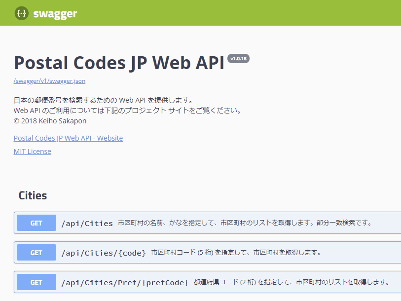

# Postal Codes JP Web API

日本の郵便番号を検索するための Web API を提供します。  
Provides the Web API to search postal codes of Japan.

この Web API は CORS (Cross-Origin Resource Sharing) をサポートしています。

## Web API のご利用について
Postal Codes JP Web API のカタログサイトとして提供されている [postal-codes-jp.azurewebsites.net](https://postal-codes-jp.azurewebsites.net/) は、商用・非商用を問わず本番運用ではお使いいただけません。
この Web API の事前調査の目的でお使いいただけます。  
また、事情によりこのサイトの運用を休止する場合があります。

このプロジェクトでは、**各利用者 (アプリ開発者) が Web API をホストして運用することを想定しています**。  
詳細は [ホスティングについて](docs/Hosting.md) をご参照ください。

## Specification
[カタログサイト](https://postal-codes-jp.azurewebsites.net/)のトップページがヘルプとなっており、API の仕様を確認できます。  
ヘルプページとして、OpenAPI (Swagger) を利用しています。

詳細は [Wiki](https://github.com/kcg-edu-future-lab/Postal-Codes-JP/wiki) をご参照ください。

## Release Notes
- **v1.0.18** 初版リリース。インターフェイスを改良。
- **v1.0.7** β版リリース。

### Future Plans
- 各配置サーバー自身で月次データをダウンロードおよび加工。
- ローマ字のデータを追加。
- 事業所のデータを追加。

## Development Environment
### Web API
- .NET Core 2.0
- ASP.NET Core 2.0.8
- Microsoft.AspNetCore.Cors 2.0.3
- Swashbuckle.AspNetCore 2.5.0

### Data Console
- .NET Framework 4.7
- [Bellona.Analysis](https://github.com/sakapon/Bellona.Analysis)
- (EntityFramework)
- (EntityFramework.SqlServerCompact)

### Records
2018.06.21-29 京都コンピュータ学院 未来環境ラボ 「Re:京都オープンデータハッカソン」
